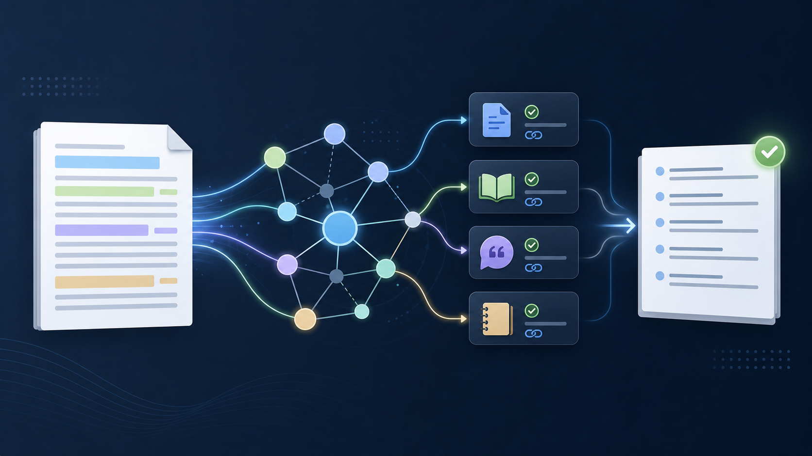
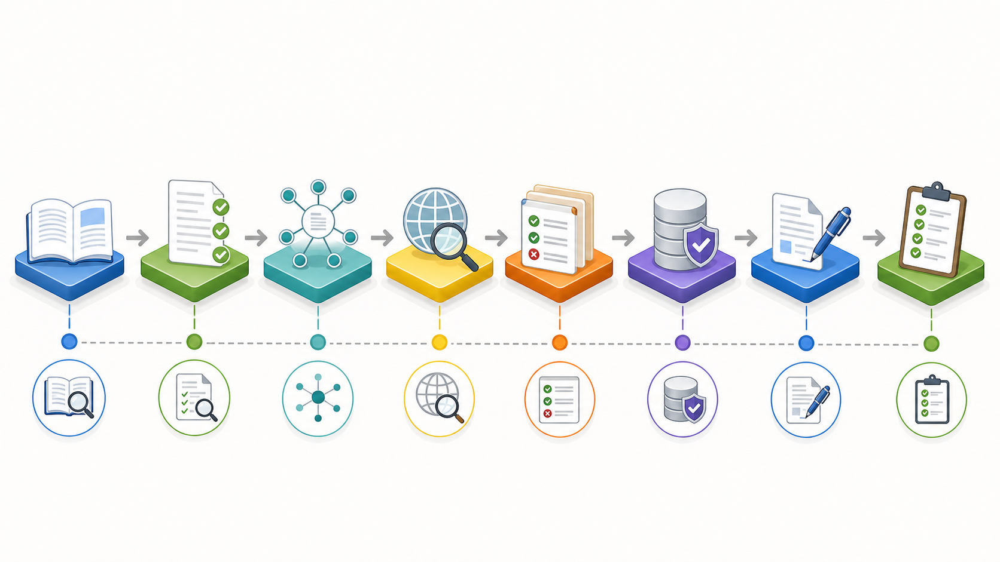
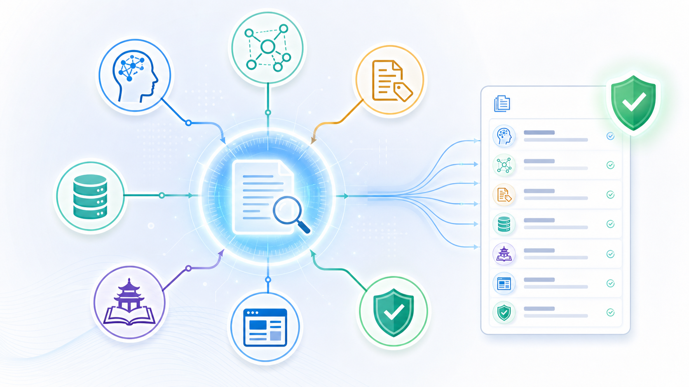

# Academic Writing Citation Support｜学术写作引用支持 Skill

Academic Writing Citation Support 是一个面向 Codex 的学术写作引用支持技能。它用于帮助 AI 写作助手从论文原文出发，识别缺少文献支撑的论断，检索相关学术文献，验证来源信息，谨慎插入 APA 文内引用，并生成可追溯的 APA 参考文献列表。

它的重点不是“给论文堆引用”，而是把每一个重要论断连接到真正能够支撑该论断的学术来源。



## 目录

- [这个 Skill 解决什么问题](#这个-skill-解决什么问题)
- [核心能力](#核心能力)
- [详细工作流程](#详细工作流程)
- [多平台分工检索策略](#多平台分工检索策略)
- [核心优势](#核心优势)
- [输出结果](#输出结果)
- [适用场景](#适用场景)
- [安装方法](#安装方法)
- [使用方法](#使用方法)
- [仓库结构](#仓库结构)
- [引用完整性原则](#引用完整性原则)
- [隐私与限制](#隐私与限制)

## 这个 Skill 解决什么问题

学术写作中的文献引用常见问题包括：

- 只用宽泛关键词找文献，找到的文章和原文论断并不完全匹配。
- 文献看起来相关，但实际不能支撑被引用的句子。
- 文内引用和参考文献列表没有相互核对。
- DOI、作者、年份、期刊、页码等元数据没有验证。
- 为了让段落“看起来更学术”，强行插入弱相关引用。
- 引用来源过于单一，只依赖一个 AI 搜索工具或一个数据库。

这个 Skill 的目标是把引用工作变成一个可审计的证据匹配过程：每个引用都应该有明确作用，每个来源都应该能验证，每个文内引用都应该和参考文献列表一致。

## 核心能力

- 从原文中识别需要文献支撑的论断。
- 基于原文的概念、方法、研究对象、情境、结果和理论来构造检索词。
- 根据任务类型选择合适平台，例如 Consensus、Elicit、Semantic Scholar、Crossref、Google Scholar、Scite、CNKI、Wanfang、PubMed、ERIC、IEEE Xplore、ACM Digital Library、PsycINFO、JSTOR 等。
- 在插入引用前验证文献来源和元数据。
- 使用 APA 7 风格插入文内引用。
- 生成 APA 参考文献列表。
- 输出“论断-来源”对应关系，方便复查。
- 对弱相关、无法验证或不匹配的来源进行标记，而不是编造引用。

## 详细工作流程



### 1. 阅读原文

Skill 首先读取用户提供的论文草稿、章节、段落、DOCX、PDF 或纯文本。它不会只根据一个宽泛主题来搜索文献，而是从原文句子和段落中提取真实的学术论断。

这一阶段关注：

- 段落的核心论点
- 关键概念和变量
- 理论框架
- 研究对象或样本
- 方法、干预或工具
- 结果、影响或评价指标
- 需要背景支撑的语境性信息

### 2. 识别需要引用的论断

不是每句话都需要引用。Skill 会优先识别真正需要文献支撑的位置，例如：

- 定义性论断
- 理论或机制性论断
- 方法设计论断
- 干预效果论断
- 工具、量表、评分标准或效度论断
- 既有研究发现
- 背景、政策、历史或事实性论断
- 统计性或比较性论断

如果某个句子只是承接上下文或表达作者自己的分析，通常不需要强行加引用。

### 3. 建立引用地图

在插入引用前，Skill 会建立一个 citation map，即引用地图。它把每个需要支撑的论断和候选文献连接起来。

引用地图通常包含：

- 原文位置
- 原始论断
- 需要的证据类型
- 检索概念
- 候选文献
- 最终选择的引用
- 验证来源
- 选择理由
- 是否存在证据不足或来源不完全匹配的问题

这样做的好处是：以后修改论文时，可以清楚知道每个引用为什么放在这里。

### 4. 多平台分工检索

Skill 不会把所有问题都交给同一个网站。不同平台有不同优势，因此它会根据论断类型分工检索。

例如：

- 需要快速找到相关论文时，用 Consensus、Elicit 或 Semantic Scholar。
- 需要系统比较样本、方法、结果时，用 Elicit、Scopus 或 Web of Science。
- 需要追踪引用关系时，用 Semantic Scholar、Google Scholar 或 Scite。
- 需要验证 DOI 和期刊信息时，用 Crossref、出版商页面或 DOI 记录。
- 需要中文文献、地区背景或本土研究时，用 CNKI、Wanfang、VIP。
- 需要特定学科数据库时，根据领域使用 PubMed、ERIC、IEEE Xplore、ACM Digital Library、PsycINFO、JSTOR、SSRN、HeinOnline 等。

这些平台的使用方式并不完全一样。Skill 本身负责判断“应该去哪里找、用什么关键词、怎样验证”，但不能绕过登录、订阅、机构权限或验证码。需要付费或机构授权的平台，用户需要提前登录，或者把检索结果、题录、PDF、DOI、BibTeX/RIS 导出文件提供给 Codex。

基本使用方式如下：

- 公开索引和元数据平台：Codex 可以直接用题名、关键词、DOI 或作者信息检索和验证，例如 Crossref、Semantic Scholar、OpenAlex、PubMed、ERIC。
- 需要账号的网站：用户先在浏览器登录，Codex 再在用户授权的网页会话中检索，例如 Consensus、Elicit、Scite、CNKI、Wanfang。
- 机构数据库或付费全文库：用户需要提供学校/机构登录、VPN、图书馆访问权限，或者直接提供导出的题录、摘要、PDF、BibTeX/RIS，例如 Scopus、Web of Science、PsycINFO、JSTOR、IEEE Xplore、ACM Digital Library、HeinOnline。
- 搜索受限的平台：如果出现验证码、二次验证、下载限制或访问限制，用户需要手动完成验证，或改为提供搜索结果、DOI、标题列表或文献文件。
- 隐私敏感文本：默认只把短关键词、短句或概念发送到第三方平台；不会把整篇私人论文上传到外部网站，除非用户明确允许。

### 5. 筛选候选文献

候选文献会按照“是否真正支持原文论断”来排序，而不是只看标题相似度。

优先级通常是：

1. 直接匹配：概念、对象、方法、情境或结果高度一致。
2. 强相邻匹配：核心概念一致，但对象或情境略有差异。
3. 理论或综述支持：适合支撑理论、定义、机制或领域共识。
4. 背景支持：适合放在文献综述或背景段落，但不足以支持具体效果论断。

会被拒绝的来源包括：

- 只是在标题中出现相同关键词，但摘要和方法不支持原文论断。
- 来源无法验证。
- 期刊或出版渠道可疑。
- 研究结论与原文论断相反。
- 需要过度解释才能支持原文句子。

### 6. 验证来源和元数据

插入引用前，Skill 会检查：

- 文献是否真实存在。
- 作者、年份、题名、期刊、卷期、页码是否可靠。
- DOI 或出版商链接是否可验证。
- 摘要、方法或全文是否支持对应论断。
- 文献证据强度是否匹配句子的表达强度。

真实存在的文献不一定就是合格引用。只有当它能支持附近句子的具体论断时，才应该被引用。

### 7. 插入 APA 文内引用

Skill 会尽量保持作者原有的写作风格、段落顺序和论证逻辑。引用插入原则包括：

- 普通论断优先使用一到两个高匹配来源。
- 避免无意义的长串引用。
- 作者作为句子主语时使用叙述式引用。
- 作为证据支撑时使用括号式引用。
- 如果插入引用导致句子过长，只做最小必要修改。
- 对来源不确定的地方标记为“需要更强来源”，不强行插入弱引用。

### 8. 最终审核

插入引用后，Skill 会进行一次引用审计：

- 每个文内引用是否都有参考文献条目。
- 每个参考文献条目是否都在正文中被引用。
- APA 格式是否一致。
- DOI 链接是否完整。
- 高价值论断是否有足够证据。
- 是否存在引用不能支撑句子的情况。

最终应输出修订文本、APA 参考文献、来源追踪和未解决问题。

## 多平台分工检索策略



| 任务需求 | 推荐平台 | 主要作用 |
|---|---|---|
| 快速发现同行评审论文 | Consensus、Elicit、Semantic Scholar | 用论断式查询快速找到可能相关的论文 |
| 系统性提取研究信息 | Elicit、Scopus、Web of Science | 比较样本、方法、结果、研究类型和结论 |
| 查找引用关系和相关研究 | Semantic Scholar、Google Scholar、Scite | 找高影响文献、后续研究、支持或反驳关系 |
| 验证 DOI 和出版信息 | Crossref、DOI 记录、出版商页面 | 核实作者、年份、期刊、卷期、页码和 DOI |
| 学科数据库检索 | PubMed、ERIC、IEEE Xplore、ACM Digital Library、PsycINFO、JSTOR、SSRN、HeinOnline | 根据学科获得更精准的文献 |
| 中文文献和本土研究 | CNKI、Wanfang、VIP | 查找中文研究、地区背景、政策语境和本土实证研究 |

基本原则是：发现工具负责找候选文献，权威索引和出版商页面负责验证最终来源。

### 不同平台需要用户提供什么

| 平台或数据库 | Skill 如何使用 | 用户需要提供什么 |
|---|---|---|
| Consensus、Elicit | 用原文论断生成短查询，找相关论文、研究摘要和候选来源 | 如果需要完整功能，用户提前登录；如果 Codex 无法直接操作网页，用户可提供搜索结果截图、导出表格、论文标题或 DOI |
| Semantic Scholar、OpenAlex、Crossref | 查找论文、引用关系、DOI、作者、年份、期刊和出版信息 | 通常不需要账号；如果题名不清楚，用户提供更完整的标题、作者或 DOI |
| Google Scholar | 作为补充检索和引用追踪入口，用于发现遗漏文献 | 用户可能需要自己处理验证码、地区限制或登录；不把它作为唯一验证来源 |
| Scite | 检查后续文献是支持、反驳还是只是提及某篇文献 | 通常需要用户账号或订阅；用户可提供 Scite 页面结果或导出信息 |
| Scopus、Web of Science | 做系统性数据库检索、引用追踪、期刊质量和筛选记录 | 用户需要机构账号、图书馆权限或 VPN；也可以提供导出的 RIS、BibTeX、CSV 或检索结果 |
| CNKI、Wanfang、VIP | 查找中文文献、本土研究、政策背景和中文核心期刊资料 | 用户需要账号、机构权限或已登录浏览器；如无法直接访问，提供题录、摘要、PDF 或导出引用 |
| PubMed、ERIC | 检索医学、健康、教育等领域的公开索引记录 | 通常不需要账号；若需要全文，用户提供机构访问或 PDF |
| IEEE Xplore、ACM Digital Library | 检索计算机、工程、系统、算法和人机交互等领域文献 | 摘要常可检索，全文通常需要机构权限；用户提供登录状态、DOI、PDF 或导出引用 |
| PsycINFO、Education Source、JSTOR、HeinOnline、Business Source 等 | 检索心理学、教育、人文社科、法律、商业管理等学科数据库 | 多数需要学校或机构订阅；用户提供图书馆登录、导出题录、摘要或全文 |
| 出版商页面、DOI 记录 | 最终核对元数据、出版状态、DOI、卷期页码和正式题名 | 通常不需要账号；如果全文在付费墙后，用户提供 PDF 或机构访问 |

实际工作时，优先采用“一个发现平台 + 一个验证平台”的组合。例如，先用 Consensus 或 Elicit 找候选论文，再用 Crossref、Semantic Scholar、DOI 记录或出版商页面验证；如果是中文论文，则先用 CNKI/Wanfang 找候选来源，再用平台题录、DOI、期刊官网或用户提供的 PDF 验证。

## 核心优势

### 1. 从原文论断出发

Skill 从原文的具体句子和段落出发，而不是只根据宽泛主题检索。这样可以减少“看起来相关但实际支撑不足”的文献。

### 2. 多平台分工，而不是单一搜索

没有任何一个文献平台是完整的。这个 Skill 把文献发现、引用追踪、元数据验证、学科数据库检索和中文文献检索分开处理，提高覆盖率和可靠性。

### 3. 强调引用与论断匹配

它关注的是“这篇文献能否支持这个句子”，而不是“这篇文献是否和主题有关”。这可以减少弱引用、装饰性引用和过度引用。

### 4. 默认 APA 7 格式

Skill 默认使用 APA 7，包括文内引用、参考文献列表、DOI 格式和引用-参考文献一致性检查。

### 5. 可追溯

它可以输出来源追踪表，记录每篇文献通过什么平台、什么查询、什么验证方式被选中。

### 6. 保留作者原文风格

它不是重写工具，而是引用增强工具。原则上保留作者的论点、段落顺序、术语和表达风格。

### 7. 不编造文献

如果找不到可靠来源，应标记为需要来源，而不是生成一个不存在或无法验证的引用。

## 输出结果

用于论文或文章草稿时，可以输出：

- 插入引用后的修订文本或 DOCX。
- APA 参考文献列表。
- 引用地图。
- 来源追踪表。
- 引用审计摘要。
- 仍缺少强证据的论断列表。

只用于文献检索时，可以输出：

- 按用途分组的推荐文献。
- 每篇文献与原文的相关性说明。
- DOI 或验证链接。
- 建议采用、拒绝或保留为背景文献的判断。

## 适用场景

- 给论文文献综述补充更相关的文献。
- 检查段落中哪些论断缺少引用。
- 给 DOCX 草稿插入 APA 引用。
- 在修改论文前建立引用地图。
- 检查文内引用和参考文献列表是否一致。
- 替换弱引用或过于宽泛的引用。
- 同时检索英文文献和中文文献。
- 为研究计划、文章草稿或章节草稿生成引用支撑。

## 安装方法

把 skill 文件夹复制到 Codex 的 skills 目录：

```bash
mkdir -p ~/.codex/skills
cp -R literature-citation-aggregator ~/.codex/skills/
```

安装后，如有需要，重启 Codex 或刷新 skills 列表。

## 使用方法

示例提示词：

```text
使用 literature-citation-aggregator 检查这篇学术稿件中哪些论断缺少文献支撑，帮我寻找相关文献，插入 APA 引用，并生成 APA 参考文献列表和来源追踪。
```

更多示例：

```text
使用 literature-citation-aggregator 检查下面这段文字，指出哪些句子需要引用，并为每个论断推荐 APA 文献。
```

```text
使用 literature-citation-aggregator 给这篇文献综述补充 APA 引用，但不要改变原文结构和论证顺序。
```

```text
使用 literature-citation-aggregator 检查现有引用是否真的支持它们所在的句子，并标记弱引用。
```

可以用于：

- DOCX 草稿
- PDF 草稿
- 纯文本稿件
- 文献综述章节
- 文章草稿
- 研究计划
- 需要引用支撑的单独段落

## 仓库结构

```text
academic-writing-citation-support/
├── README.md
├── LICENSE
├── .gitignore
├── assets/
│   ├── academic-citation-hero.png
│   ├── citation-workflow.png
│   └── source-routing-verification.png
└── literature-citation-aggregator/
    ├── SKILL.md
    ├── agents/
    ├── references/
    └── scripts/
```

## 引用完整性原则

这个 Skill 遵循以下原则：

- 不编造文献。
- 不使用无法验证的来源。
- 不把只相关于大主题的文献强行插到具体论断后面。
- 不为了增加引用数量而堆叠引用。
- 优先选择最能支持具体句子的文献。
- 对证据不足的地方明确标记。
- 保留作者原有论证结构。

## 隐私与限制

这个 Skill 可以指导检索、验证、插入引用和 APA 格式整理，但不能替代作者、导师或审稿人的最终学术判断。

部分文献可能需要学校图书馆、机构数据库或付费全文权限。对于重要论文、毕业论文、投稿论文或高风险学术提交，最终稿仍应由作者或导师复核。

处理私密稿件时，不应未经明确同意把完整论文上传到第三方网站。更稳妥的做法是使用短查询、关键词组合或必要的最小文本片段进行检索。

## 配图说明

README 中的三张配图使用 image-2 生成，仅用于说明工作流程和检索逻辑，不包含任何个人论文内容或特定研究主题。

## License

MIT License.
